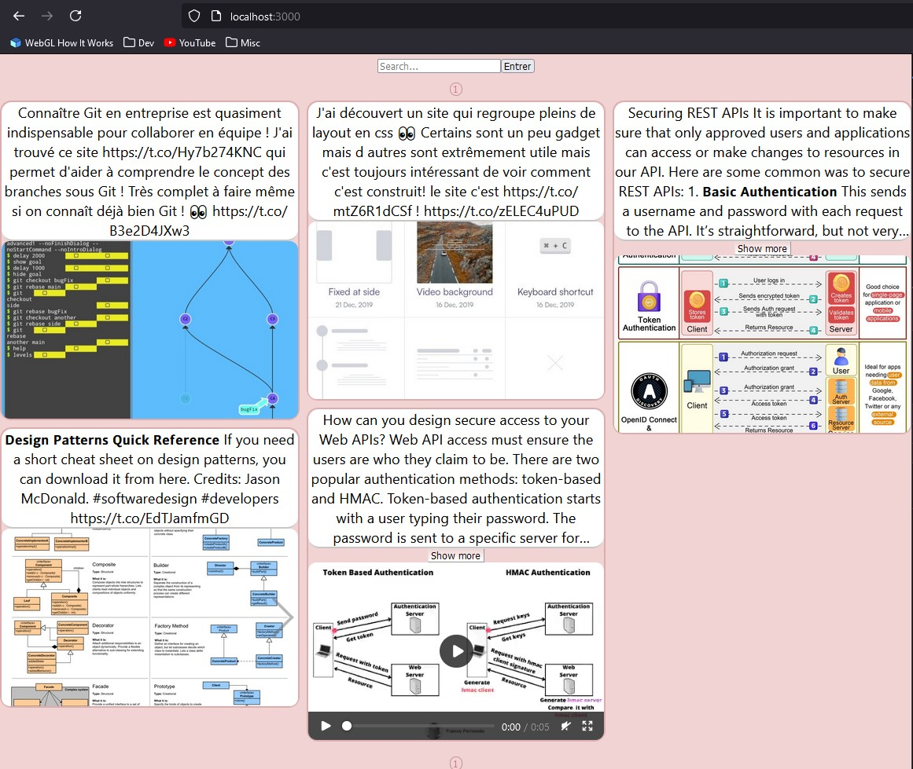

# What is Rosearch ?

Rosearch is a simple web app to search resources in a database. These resources are called "targets" and consist of a text with optional medias (images/videos/gifs)\
The technologies/frameworks used are React for the front, Django for the back (proxied by nginx), and PostgreSQL for the database. The whole app is containerized with Docker.\
The project is made for pure educational purposes.



# Run the project

To launch the project, you'll need to have [Docker](https://www.docker.com/) installed first.

1) Retrieve the projects
    ```
    # In local dev folder
    git clone https://github.com/LedruRollin/Rosearch.git
    cd Rosearch
    git clone https://github.com/LedruRollin/Roback.git
    git clone https://github.com/LedruRollin/Rofront.git
    ```

2) Run the project

    The project can now be launched thanks to :
    
    ```
    docker compose up
    ```
    
    To check everything works fine, you can then access the front at `http://localhost:3000/login` or at `http://localhost:3000/` if already authenticated.
    To log in, the database is initialized with one super user with username `admin` and password `pwd`.


# URLs of interest

- Main view : http://localhost:3000
- Login view : http://localhost:3000/login
- API docs : http://localhost:8000/api/schema/swagger-ui/
- Django admin page : http://localhost:8000/admin

# /!\ Data non persistance /!\

The provided `entrypoint.sh` performs a flush command. 
Which means each time the container is stopped and rerun, the existing data is flushed. In other words, any added/modified data will be permanently lost at container stop.
This behaviour, which might evolve later, is done to ensure constant state and reproducibility.\
To change this, you can remove this flush command or create your own `local-entrypoint.sh`
